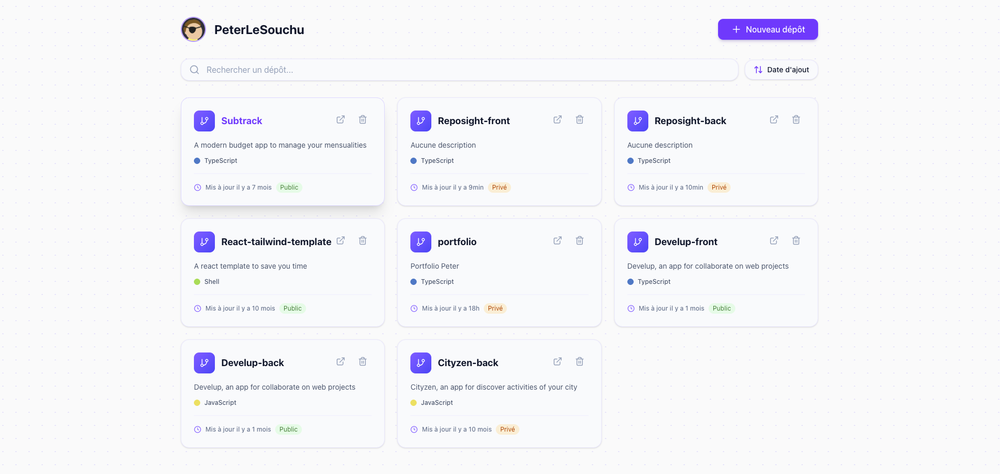

# 🌟 Projet Reposight

**Reposight est une application web réalisée dans le cadre de mon portfolio pour aider les développeurs à visualiser, analyser et comparer les statistiques de leurs dépôts GitHub. Les utilisateurs peuvent lier leur compte GitHub à Reposight, explorer leurs dépôts, suivre leurs performances via des graphiques dédiés et disposer d’une vision synthétique pour mieux orienter leur travail en équipe.**

L’application n’est malheureusement pas disponible en production : elle repose sur des cookies tiers pour l’authentification (désactivés par défaut dans la plupart des navigateurs) et le front ne partage pas le même nom de domaine que le back-end.

## ⭐ Fonctionnalités principales

- Se connecter en liant son compte GitHub à la plateforme.
- Rechercher, trier et sélectionner/ajouter les dépôts à suivre dans Reposight.
- Retirer un dépôt GitHub de sa sélection.
- Supprimer son compte.
- Accéder à une page détail riche pour chaque dépôt :
  - Vue d’ensemble (nom, statut privé/public, description, forks, stars, watchers, nombre de contributeurs, langages, date du dernier commit).
  - Historique des commits, pull requests et issues sur les dernières 48 h avec liens vers GitHub.
  - Visualisation de l’activité sur 30 jours grâce à un graphique interactif.
  - Comparaison hebdomadaire des commits/PRs/issues avec pourcentage d’évolution.
  - Liste des contributeurs et volume de commits associés.
  - Recherche et filtres avancés par auteur, branche et statut pour les commits, PRs et issues.
- Parcours d’onboarding guidé pour accompagner les nouveaux utilisateurs.

**Ce dépôt contient la partie front-end de Reposight. La partie back-end est disponible ici : [Reposight-back](https://github.com/PeterLeSouchu/Reposight-back).**

## 🛠️ Fonctionnement du front-end

### ⚙️ Architecture

- Application Next.js (App Router) avec React 19.
- Tailwind CSS 4 pour la base stylistique et composants UI inspirés de shadcn/ui.
- Pages protégées (`/repositories`, `/repository/[id]`) via middleware Next.js.
- Visualisations et animations réalisées avec Recharts et Motion.

### 🔒 Sécurité & Authentification

- Authentification via OAuth GitHub côté back-end : le serveur renvoie deux tokens :
  - un `refresh_token` stocké dans un cookie HTTP-only (inaccessible côté JavaScript, durée de vie longue) ;
  - un `access_token` injecté dans un state Zustand non persistant côté client (durée courte).
- Axios initialisé avec `withCredentials: false` pour ne pas renvoyer inutilement les cookies ; seules les requêtes critiques (refresh, logout, suppression de compte, etc.) l’activent explicitement.
- Intercepteur Axios :
  - ajoute le `access_token` aux en-têtes `Authorization` de chaque requête sortante pour se prémunir des attaques CSRF ;
  - tente un rafraîchissement (`/auth/refresh`) lorsque l’API renvoie un `401` dû à l’expiration du token d’accès (envoie alors le cookie `refresh_token` via `withCredentials: true`) ;
  - met les requêtes en file d’attente pendant le rafraîchissement pour éviter les duplications et, en cas d’échec, nettoie l’état et redirige vers `/login`.
- Middleware Next.js vérifie la présence du cookie `refresh_token` avant d’autoriser l’accès aux routes privées.

### 🧠 Gestion de l’état et des données

- [@tanstack/react-query](https://tanstack.com/query/latest) gère le cache des requêtes GitHub et back-end, le préchargement et la synchronisation.
- Stores [Zustand](https://zustand-demo.pmnd.rs/) dédiés :
  - `authStore` pour conserver le token d’accès en mémoire.
  - `onboardingStore` pour déclencher ou terminer le parcours guidé.
- [nextstepjs](https://www.nextstepjs.com/) orchestre le tutoriel d’onboarding.

### 🚨 Gestion des erreurs & notifications

- Composant `ErrorMessage` pour afficher les erreurs critiques lors des fetchs (pages repositories, repository, etc.).
- Toasters [sonner](https://sonner.emilkowal.ski/) déclenchés dans les mutations React Query pour notifier les succès ou échecs (ajout/suppression de dépôt, suppression de compte, logout).

### ⏳ Expérience de chargement

- Skeletons dédiés (`RepositoriesSkeleton`, `RepositorySkeleton`) pour chaque vue de données.
- Gestion du chargement et de l’invalidation via les états `isLoading` / `isPending` de React Query.
- Détection des dépôts supprimés grâce à `useNotifyDeletedRepos` (toast) pour informer l’utilisateur si les dépôts ont été supprimés ou si nous ne sommes plus collaborateurs sur ce dépôt.
- Recherche instantanée avec debounce (`use-debounce`) et tris côté client pour conserver une interface fluide.

### 💻 Technologies utilisées

- [Next.js](https://nextjs.org/) 15 & [React](https://react.dev/) 19
- [Tailwind CSS](https://tailwindcss.com/) 4
- [@tanstack/react-query](https://tanstack.com/query/latest) pour la gestion des requêtes
- [Axios](https://axios-http.com/) pour la couche HTTP
- [Zustand](https://zustand-demo.pmnd.rs/) pour l’état local partagé
- [Recharts](https://recharts.org/en-US/) pour les graphiques
- [Motion](https://motion.dev/) pour les animations et transitions
- [nextstepjs](https://www.nextstepjs.com/) pour l’onboarding interactif
- [Sonner](https://sonner.emilkowal.ski/) pour les notifications toast
- [lucide-react](https://lucide.dev/) et `react-fast-marquee` pour l’illustration et l’animation
